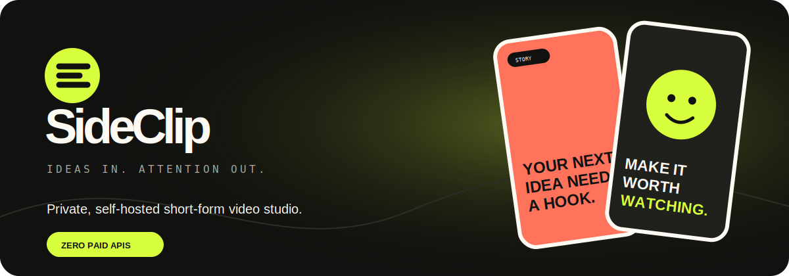

# SideClip



[](https://github.com/SubchiBeats/sideclip/actions/workflows/test.yml)
[](https://nodejs.org)
[](LICENSE)
[](#zero-cost-boundaries)

> **Ideas in. Attention out.**
> A private, self-hosted studio for planning, producing, and exporting
> short-form social videos without paid APIs.

SideClip turns a campaign brief into a 30-idea content plan, helps you refine
each hook, and renders vertical videos directly in your browser. Accounts,
projects, uploads, and optional local AI stay on infrastructure you control.

## Why SideClip

Small teams need a consistent stream of social video, but subscriptions,
editing timelines, and blank-page anxiety slow down the work. SideClip provides
a useful production loop without introducing another monthly bill:

1. Describe the product, audience, and goal.
2. Generate a month of story, education, and promotion ideas.
3. Edit the hook, supporting copy, media, color, and voiceover.
4. Export a 9:16 WebM, captions, and a ready-to-post caption pack.

## Features

| Capability | Included |
| --- | :---: |
| Secure local accounts with salted `scrypt` hashes | ✅ |
| Persistent private projects and media library | ✅ |
| Built-in zero-cost content planning engine | ✅ |
| Product-specific hook angles and publish-readiness checks | ✅ |
| Six distinct procedural video styles | ✅ |
| Complete hook-aligned social captions | ✅ |
| Optional private AI through local Ollama | ✅ |
| Uploaded image and video backgrounds | ✅ |
| Recorded/uploaded voiceovers embedded in exports | ✅ |
| Browser-rendered 9:16 WebM video | ✅ |
| Persistent light and dark themes | ✅ |
| SRT captions, posting packs, and device sharing | ✅ |
| Installable PWA and offline core interface | ✅ |
| Docker deployment, rate limiting, and security headers | ✅ |

## Quick start

Requires [Node.js 20+](https://nodejs.org/). There are no runtime dependencies,
so no install step is required.

```bash
git clone https://github.com/SubchiBeats/sideclip.git
cd sideclip
npm start
```

Open <http://localhost:4173>.

On Windows, you can also double-click `run.ps1`.

## Optional local AI

SideClip works without an AI service. For richer ideation, install
[Ollama](https://ollama.com/), pull a free local model, and provide its name:

```powershell
ollama pull llama3.2:3b
$env:OLLAMA_MODEL="llama3.2:3b"
npm start
```

Prompts stay between SideClip and your configured Ollama server.

On Windows, after installing Ollama and pulling the model once, you can also
double-click `run-local-ai.ps1`. SideClip uses schema-constrained output and
its publish-readiness checks to reject weak local-model suggestions.

## Architecture

```text
Browser / PWA
  ├─ campaign planner and clip editor
  ├─ Canvas + MediaRecorder video renderer
  ├─ microphone voiceover capture
  └─ captions, posting packs, and Web Share
         │
         ▼
Zero-dependency Node server
  ├─ HTTP-only sessions and scrypt password hashes
  ├─ project and media ownership checks
  ├─ atomic local JSON persistence
  ├─ constrained private uploads
  └─ offline generator or optional Ollama adapter
```

SideClip intentionally avoids a framework, external database, and runtime npm
dependencies. This keeps self-hosting straightforward and the operating cost
at zero on hardware you already own.

## Docker

```bash
docker compose up --build -d
```

The named `sideclip-data` volume stores accounts, projects, and uploads.

## Test

```bash
npm test
```

Tests cover frontend contracts, offline generation, salted password
verification, authentication, project persistence, private uploads,
cross-origin write protection, data export, account deletion, unique post
copy, hook relevance, promised-list delivery, and collision-proof video layout.

## Production deployment

Run SideClip behind a TLS reverse proxy such as Caddy or nginx. Persist and
back up `data/`. When HTTPS is active, use:

```bash
HOST=0.0.0.0 PORT=4173 COOKIE_SECURE=true npm start
```

See [SECURITY.md](SECURITY.md) before exposing an installation publicly.

## Zero-cost boundaries

The default app is private and free to operate on hardware you already own.
Public hosting, domains, backups, and large-model compute can still cost money
depending on your deployment.

Direct automated social posting is intentionally not included. Social
platforms require user-owned developer credentials, app review, and changing
API permissions. SideClip creates videos, captions, posting packs, and uses the
device share sheet instead.

## Contributing

Contributions are welcome. See [CONTRIBUTING.md](CONTRIBUTING.md) for the
development workflow and project principles.

## License

MIT — see [LICENSE](LICENSE).
